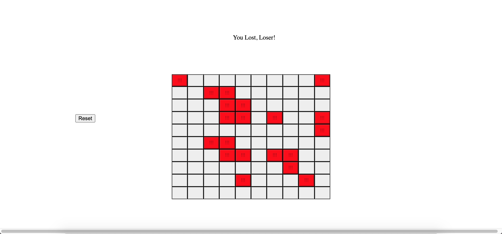

# Minesweeper
---
The word minesweeper comes from the ancient Egyptian word minne swiip, which roughly translates into 'the contest of the living gods.' While 5,000 years ago the game was only played by the masters of slaves, today, minesweeper has widespread appeal.

It has now become custom in the luxurious board rooms of Abu Dhabi for business meetings to only proceed after the participants have gotten to know each other over discussion of the latest sweeping strategies. In the Peruvian Andes, the floors of dance halls often take the form of outsized sweeping boards, the dancers moving with grace and wits to avoid the live mines hidden below the surface.

Built in one afternoon as a way to experiment with React Redux and Context API, Mark's Minesweeper has already received heartfelt endorsements from many of the nation’s most influential leaders. Founder Mark Fuechec expects the game to be the pre-eminent online Minesweeper game by Q3 2020. He has promised to consolidate the industry through acquisition and parnership with other leading Minesweeper companies.

           — Haters - ‘We acclaim this.’

           — Former president Bill Clinton - ‘I enjoy the mindsweeper(sic) product.’
               * Compensated endorsement

           — Soup Nazi from Seinfeld - ‘What is this minesweeper? This is game?’
               * Said in an excited way, like ‘Can you believe what is this minesweeper!’

# Get started
---
From terminal in the root directory:

```

npm install

npm run client

npm start

```

Then navigate to localhost:4001 in your browser.

# In Action
---



# Front-End
---
Minesweeper is a React Native application built with JavaScript.

# Contributors
---
[Mark Fuechec](https://github.com/mfuechec)
